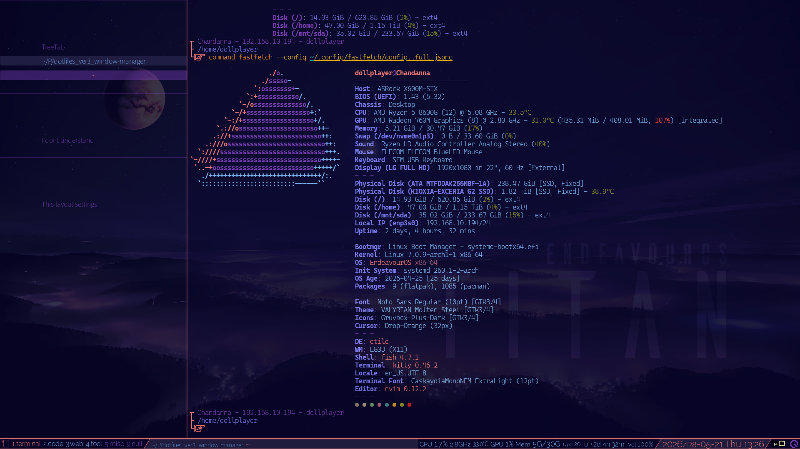

# Qtile configration

Oct. 7, 2026.

1. Using dmenu
1. **Not** Using qtile-extras

Notes of special interest follow below.

- [01. Workspaces and layouts](./docs/01.workspaces_and_layouts.md)
- [02. keybinds in images](./docs/02.keybinds_in_images.md)

## TODO:

- [x] Complete separation of `scripts/autostart.sh`  
`scripts/autostart..chandanna.sh` and `scripts/autostart..bacstual.sh`

- [x] Revised the description so that it does not assume the use of multiple monitors.  
And Rename `modules/screenbar_*.py` to `built_in_widgets.py` ?  
**This as concluded for the time being.**

- [x] Separating the configuration and placement of built-in widgets (to avoid lengthy code)  
**For some reason—though I haven't investigated why—the GPU load isn't displayed on the ASRock X600M-STX.**

- [x] Long-term goal: Implement a shutdown menu (or similar) using dmenu or Rofi.  
Decided not to use the Popup Toolkit from qtile-extras.
    - Adoption of dmenu
    - Likely not currently using qtile-extras.

- [x] In connection with the above, I am re-examining whether it is necessary to use qtile-extras.
    - Likely not currently using qtile-extras.

- [ ] The possibility of using dmenu in situations requiring Yes/No selections or similar choices.

- [ ] It’s a pretty heavy coding task for me, but... should I revisit `gen-keybinding-img`?

