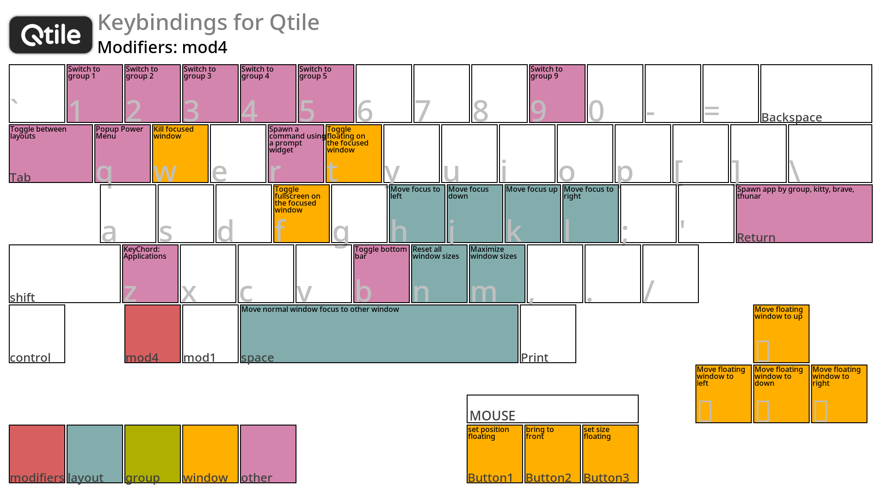
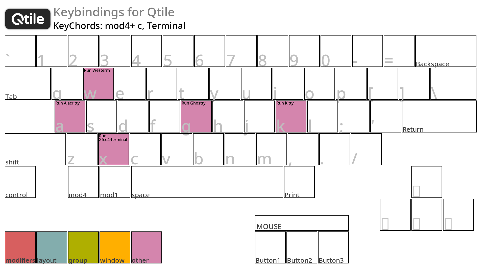
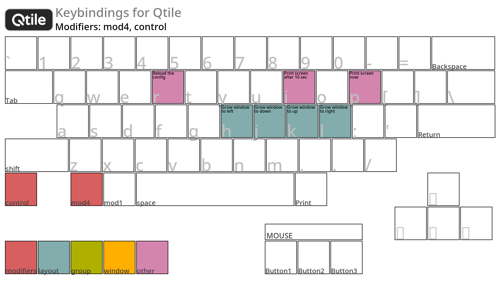
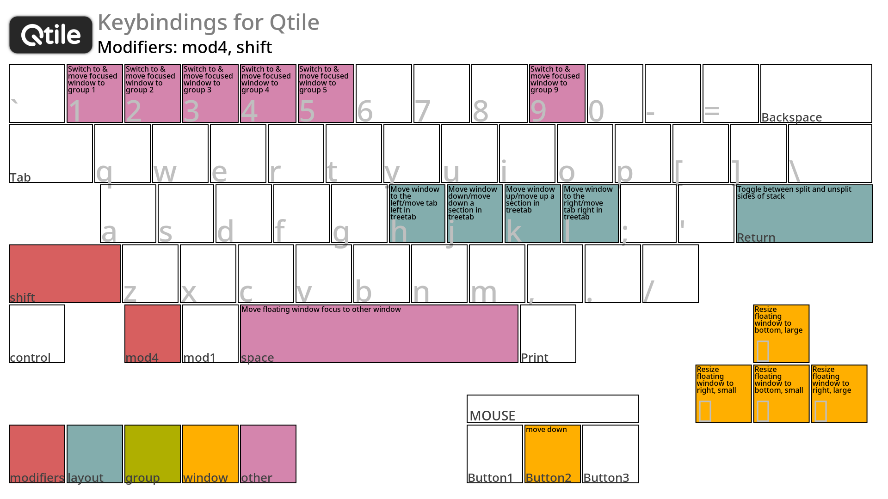
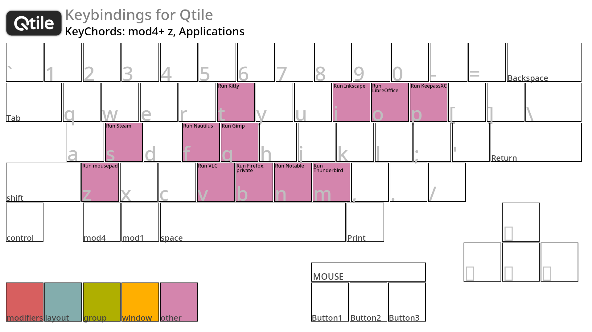

# 02. keybinds in images

I use a modified version of `scripts/gen-keybinding-img`, [Keybindings in images — Qtile](https://docs.qtile.org/en/latest/manual/commands/keybindings.html).

 

## Preparations for launching `scripts/gen-keybinding-img`

To begin with, when installing packages on EndeavourOS, it is possible that the `scripts/gen-keybinding-img` component will not be installed.
Launch `scripts/gen-keybinding-img` using the steps below, but I am not sure if this is the correct procedure.

1. Download [`scripts/gen-keybinding-img`](https://github.com/qtile/qtile/blob/master/scripts/gen-keybinding-img) to `./qtile/scripts` directory.
1. Download [Qtile logo.png](https://github.com/qtile/qtile/blob/master/libqtile/resources/logo.png) to `./qtile` directory.
1. `mkdir ./qtile/bin`, `cd ./qtile/bin` and `ln -s /usr/bin/qtile`.
1. `mkdir ./qtile/keybind-map`, this is the directory where images generated by executing `scripts/gen-keybinding-img` are stored.

After this preparation, run `scripts/gen-keybinding-img`.
In my case, instead of running `scripts/gen-keybinding-img` directly from the command line, I run [`./qtile/scripts/gen-keybinding-img.sh`](../scripts/gen-keybinding-img.sh).

